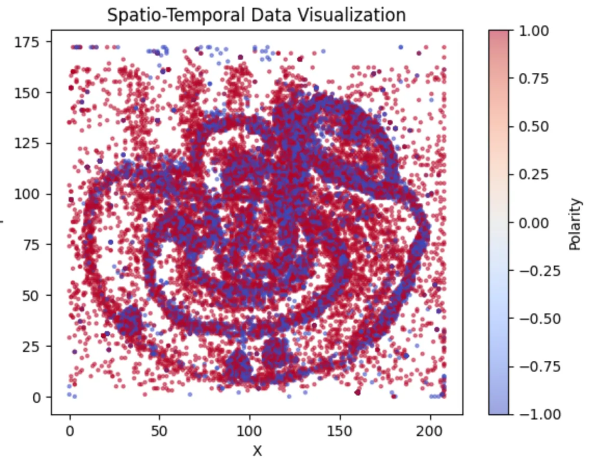
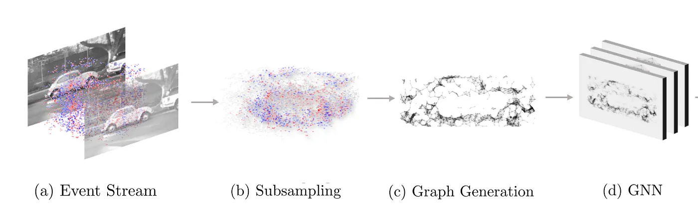

# Replication results for *AEGNN: Asynchronous Event-based Graph Neural Networks*

This blog post and code replication are done by the following students from group 69 as part of their CS4240 Deep Learning 2022–23 course project:

|Name|ID|Contact|Contribution|
|-|-|-|-|
|Justas Andriuskevicius|5062632|J.Andriuskevicius-1@student.tudelft.nl|model training, result analysis, hyperparam tuning, model architecture tuning|
|Dequan Ou|5095441|d.ou@student.tudelft.nl|dataset preparation, preprocessing|
|Yueqian Liu|5758386|y.liu-133@student.tudelft.nl|setting up the env, preprocessing, documentation writing|

> link to: [paper](http://rpg.ifi.uzh.ch/docs/CVPR22_Schaefer.pdf), [official code](https://github.com/uzh-rpg/aegnn), [tlwzzy's code repository](https://github.com/tlwzzy/aegnn)

## Introduction

The original paper introduced Asynchronous, Event-based Graph Neural Networks (AEGNNs), a novel event-processing paradigm that introduces a new way of processing events sparsely and asynchronously as temporally evolving graphs. This approach offers a significant reduction in computation and latency for event-by-event processing, which can be beneficial for various challenging applications, including robotics, autonomous driving, and IoT video surveillance.

Our objective is to critically analyze the paper’s experimental results on object recognition using the NCaltech101 dataset by replicating the experiments. To achieve this, we will preprocess the data using the official preprocessing function and train the model using tlwzzy’s training code. We also intend to train the model using different parameters, such as various learning rates and loss activation functions. Our aim is to reproduce the results reported in the paper and report any discrepancies we encounter.

## Dataset and Preprocessing

The paper evaluated the performance of Asynchronous Event-based Graph Neural Networks (AEGNNs) on the object recognition task using the Caltech101 dataset. The Caltech101 dataset contains 9,000 images across 101 object categories and can be found [here](https://www.garrickorchard.com/datasets/n-caltech101). To prepare the data for training, the original preprocessing script provided with the dataset was used.

The dataset was split into training, validation, and testing sets in an 8:1:1 ratio. Each image was captured using an event camera, resulting in a binary stream of events rather than traditional frames. Each event contains information on the change in intensity at a specific pixel location and timestamp. An visualization of a *brain* data is shown on the following figures.

 

To reduce the computational complexity, each bin file containing events was randomly subsampled to retain only 15,000 events. Additionally, the temporal position of each event was normalized by a factor of beta to account for the differences in event rates between the cameras used to capture the dataset.



To feed the preprocessed data into the neural network, edges were generated between pairs of nodes in the spatiotemporal graph representation of the event data. These preprocessed data were then fed into a data loader to form batches for training the AEGNNs model. Overall, these preprocessing steps aimed to reduce the computational complexity of the dataset while retaining the spatiotemporal information of the events necessary for accurate object recognition.

## Updated Code

In this section, the updates and improvements made to the codebase to enhance usability of the implemented model are discussed. These changes are necessary to resolve potential issues, and provide a more comprehensive understanding of the underlying processes..

The reason for this [change](https://github.com/uzh-rpg/aegnn/commit/f89d0f02a7d2529b61f1b1813a3345e7efff9858#diff-32a911ef66e9808c5f6d3f28b7a040c6b49ba7906126c25f76fe0dba94e553f5) in `max_pool_x.py` file is likely due to an update in the `torch_geometric` library. It appears that the structure of the library has been reorganised, and the `max_pool_x` and `voxel_grid` functions have been moved from the `torch_geometric.nn.pool` submodule to the `torch_geometric.nn` module.

In the [change](https://github.com/uzh-rpg/aegnn/commit/f89d0f02a7d2529b61f1b1813a3345e7efff9858#diff-1b97a5326ffbfe580f66e53ed1d437c5ad5c01ea58a149917cfaf3e01eeb1035) to `ncaltech101.py`, a new variable `original_num_nodes` is added to store the initial number of nodes in the input data. This variable is used in the for loop to check the tensor size against the original number of nodes instead of the updated `data.num_nodes`. This change makes the code more robust and avoids potential issues due to changing `data.num_nodes` during the loop. The main issue is solved with this change which was after subsampling `data.pos` and `data.x` were never matching in length. If it is not matching the model cannot be trained.

---

> Original README below.

# AEGNN: Asynchronous Event-based Graph Neural Networks
<p align="center">
  <a href="https://youtu.be/opbFE6OsAeA">
    
  </a>
</p>

This repository contains code from our 2022 CVPR paper [**AEGNN: Asynchronous Event-based Graph Neural Networks**](http://rpg.ifi.uzh.ch/docs/CVPR22_Schaefer.pdf) by Simon Schaefer*, [Daniel Gehrig*](https://danielgehrig18.github.io/), and [Davide Scaramuzza](http://rpg.ifi.uzh.ch/people_scaramuzza.html). If you use our code or refer to this project, please cite it using 

```
@inproceedings{Schaefer22cvpr,
  author    = {Schaefer, Simon and Gehrig, Daniel and Scaramuzza, Davide},
  title     = {AEGNN: Asynchronous Event-based Graph Neural Networks},
  booktitle = {IEEE Conference on Computer Vision and Pattern Recognition},
  year      = {2022}
}
```

## Installation
The code heavily depends on PyTorch and the [PyG](https://github.com/pyg-team/pytorch_geometric) framework, which is 
optimized only for GPUs supporting CUDA. For our implementation the CUDA version 11.3 is used. Install the project
requirements with:
```
conda env create --file=environment.yml
```

## Processing Pipeline
We evaluated our approach on three datasets. [NCars](http://www.prophesee.ai/dataset-n-cars/), 
[NCaltech101](https://www.garrickorchard.com/datasets/n-caltech101) and 
[Prophesee Gen1 Automotive](https://www.prophesee.ai/2020/01/24/prophesee-gen1-automotive-detection-dataset/).
Download them and extract them. By default, they are assumed to be in `/data/storage/`, this can be changed by setting
the `AEGNN_DATA_DIR` environment variable. 

### Pre-Processing
To efficiently train the graph neural networks, the event graph is generated offline during pre-processing. For 
specific instructions about the data structure and data pre-processing, please refer to the 
[dataset's readme](aegnn/datasets/README.md).

## Asynchronous & Sparse Pipeline
The code allows to make **any graph-based convolutional model** asynchronous & sparse, with a simple command and without 
the need to change the model's definition or forward function.
```
>>> import aegnn
>>> model = GraphConvModel()
>>> model = aegnn.asyncronous.make_model_asynchronous(model, **kwargs)
```
We support all graph convolutional layers, max pooling, linear layers and more. As each layer is independently 
transformed to work asynchronously and sparsely, if there is a layer, that we do not support, its dense equivalent 
is used instead. 

## Evaluation
We support automatic flops and runtime analysis, by using hooking each layer's forward pass. Similar to the 
`make_model_asynchronous()` function, among other, all graph-based convolutional layers, the linear layer and 
batch normalization are supported. As an example, to run an analysis of our model on the 
NCars dataset, you can use:
```
python3 aegnn/evaluation/flops.py --device X
```


## Contributing
If you spot any bugs or if you are planning to contribute back bug-fixes, please open an issue and
discuss the feature with us.
