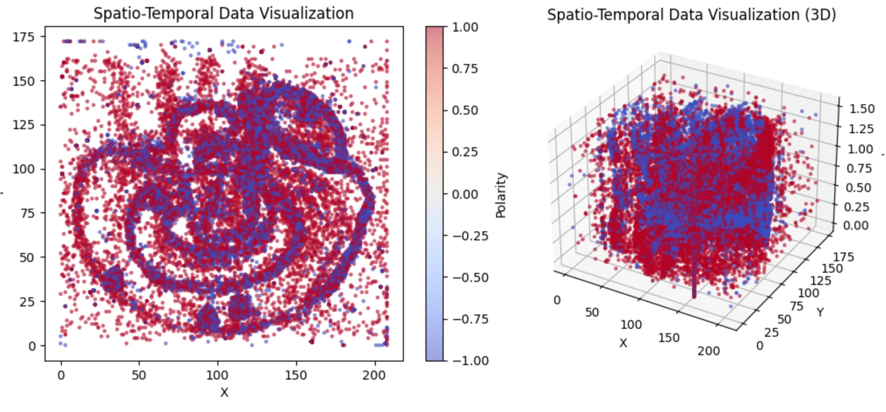
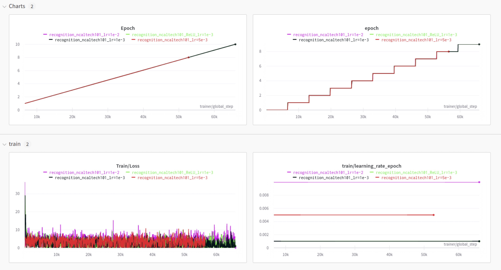
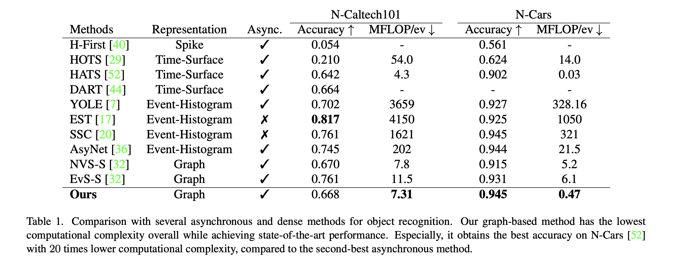
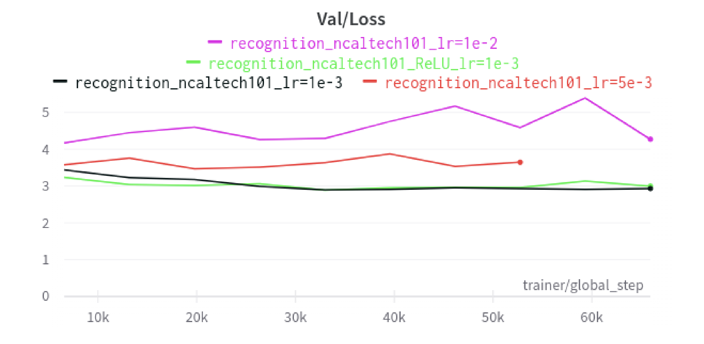
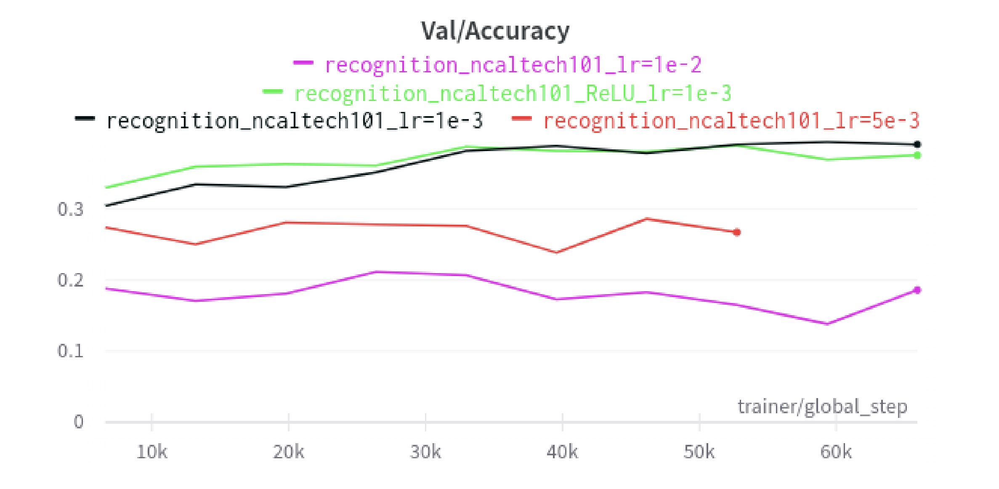
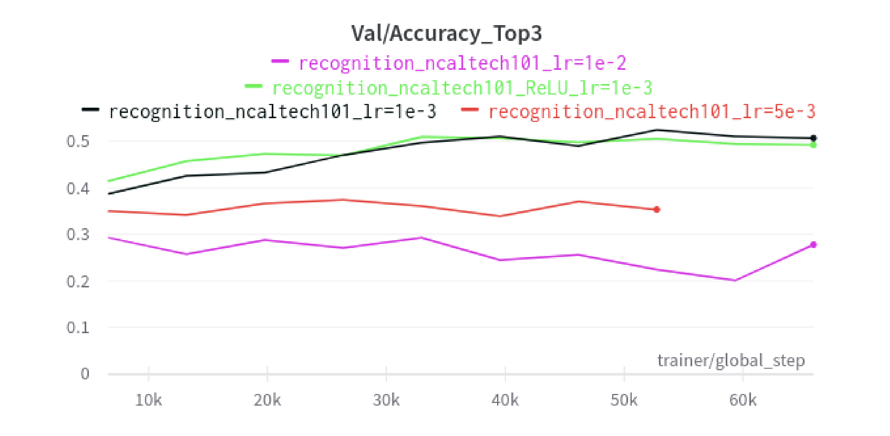
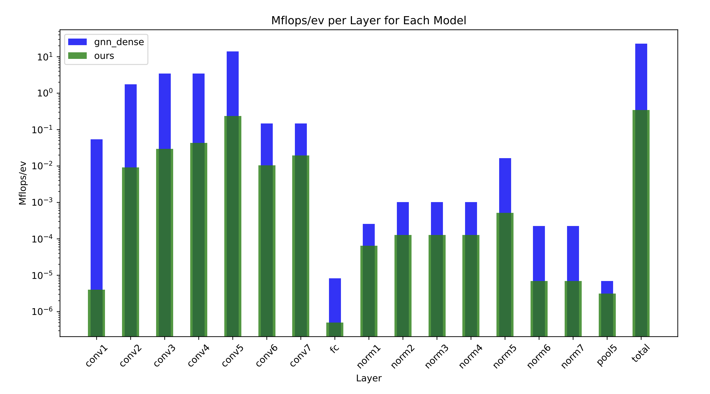
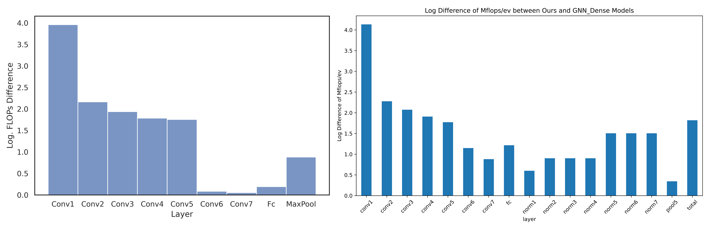
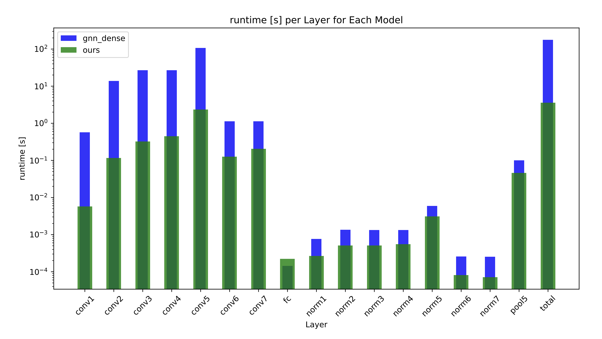

↖ The outline is here :p

# Replication results for *AEGNN: Asynchronous Event-based Graph Neural Networks*

This blog post and code replication are done by the following students from group 69 as part of their CS4240 Deep Learning 2022–23 course project:

|Name|ID|Contact|Contribution|
|-|-|-|-|
|Justas Andriuskevicius|5062632|J.Andriuskevicius-1@student.tudelft.nl|model training, result analysis, hyperparam tuning, model architecture tuning|
|Dequan Ou|5095441|d.ou@student.tudelft.nl|dataset preparation, preprocessing|
|Yueqian Liu|5758386|y.liu-133@student.tudelft.nl|setting up the env, preprocessing, documentation writing|

Our effort is mostly in [`coursework.ipynb`](https://github.com/ErcBunny/aegnn-CS4240-TUD/blob/master/coursework.ipynb), which contains all the steps for a complete replication. Also we managed to "hack" the official code based on the official repo and another repo by tlwzzy.

> link to: [paper](http://rpg.ifi.uzh.ch/docs/CVPR22_Schaefer.pdf), [official code](https://github.com/uzh-rpg/aegnn), [tlwzzy's code repository](https://github.com/tlwzzy/aegnn), [original README](https://github.com/ErcBunny/aegnn-CS4240-TUD#aegnn-asynchronous-event-based-graph-neural-networks)

## Introduction

The original paper introduced Asynchronous, Event-based Graph Neural Networks (AEGNNs), a novel event-processing paradigm that introduces a new way of processing events sparsely and asynchronously as temporally evolving graphs. This approach offers a significant reduction in computation and latency for event-by-event processing, which can be beneficial for various challenging applications, including robotics, autonomous driving, and IoT video surveillance.

Our objective is to critically analyze the paper’s experimental results on object recognition using the NCaltech101 dataset by replicating the experiments. To achieve this, we will preprocess the data using the official preprocessing function and train the model using tlwzzy’s training code. We also intend to train the model using different parameters, such as various learning rates and loss activation functions. Our aim is to reproduce the results reported in the paper and report any discrepancies we encounter.

## Dataset and Preprocessing

The paper evaluated the performance of Asynchronous Event-based Graph Neural Networks (AEGNNs) on the object recognition task using the Caltech101 dataset. The Caltech101 dataset contains 9,000 images across 101 object categories and can be found [here](https://www.garrickorchard.com/datasets/n-caltech101). To prepare the data for training, the original preprocessing script provided with the dataset was used.

The dataset was split into training, validation, and testing sets in an 8:1:1 ratio. Each image was captured using an event camera, resulting in a binary stream of events rather than traditional frames. Each event contains information on the change in intensity at a specific pixel location and timestamp. An visualization of a *brain* data is shown on the following figures.



To reduce the computational complexity, each bin file containing events was randomly subsampled to retain only 15,000 events. Additionally, the temporal position of each event was normalized by a factor of beta to account for the differences in event rates between the cameras used to capture the dataset.


To feed the preprocessed data into the neural network, edges were generated between pairs of nodes in the spatiotemporal graph representation of the event data. These preprocessed data were then fed into a data loader to form batches for training the AEGNNs model. Overall, these preprocessing steps aimed to reduce the computational complexity of the dataset while retaining the spatiotemporal information of the events necessary for accurate object recognition.

## Changes to Official Code

In this section, the updates and improvements made to the codebase to enhance usability of the implemented model are discussed. These changes are necessary to resolve potential issues, and provide a more comprehensive understanding of the underlying processes..

The reason for this [change](https://github.com/ErcBunny/aegnn-CS4240-TUD/commit/f89d0f02a7d2529b61f1b1813a3345e7efff9858#diff-32a911ef66e9808c5f6d3f28b7a040c6b49ba7906126c25f76fe0dba94e553f5) in `max_pool_x.py` file is likely due to an update in the `torch_geometric` library. It appears that the structure of the library has been reorganised, and the `max_pool_x` and `voxel_grid` functions have been moved from the `torch_geometric.nn.pool` submodule to the `torch_geometric.nn` module.

In the [change](https://github.com/ErcBunny/aegnn-CS4240-TUD/commit/f89d0f02a7d2529b61f1b1813a3345e7efff9858#diff-1b97a5326ffbfe580f66e53ed1d437c5ad5c01ea58a149917cfaf3e01eeb1035) in `ncaltech101.py`, a new variable `original_num_nodes` is added to store the initial number of nodes in the input data. This variable is used in the for loop to check the tensor size against the original number of nodes instead of the updated `data.num_nodes`. This change makes the code more robust and avoids potential issues due to changing `data.num_nodes` during the loop. The main issue is solved with this change which was after subsampling `data.pos` and `data.x` were never matching in length. If it is not matching the model cannot be trained.

The changes in the code add functionality to handle the training and validation process for the `RecognitionModel` class can be seen [here](https://github.com/ErcBunny/aegnn-CS4240-TUD/commit/f89d0f02a7d2529b61f1b1813a3345e7efff9858#diff-9841ae1aee17d783bd32b8084371ae0fa64b6f774fe11cf6a16346ce86850361). By including these methods, the model can now be trained and validated using PyTorch Lightning's built-in training loop. Also `train.py` file, which helps track the training and validation progress in the [Weights & Biases](https://wandb.ai/site) platform.

## Training

The preprocessed Ncaltech101 dataset was used to train the model. Training was done for 3 different learning rates (`1e-2`, original `1e-3`, and `5e-3`) and once for a different activation function (ReLU instead of ELU). All of the trainings had 10 epochs. The reason is mentioned in ***Challenges*** section. The architecture of the recognition model comprises convolutional blocks, each consisting of a `SplineConv` layer, characterised by the number of output channels `Mout` and kernel size `k`, an ELU activation function, and batch normalisation. Max graph pooling layers are incorporated after the fifth and seventh convolutions, with skip connections included after the fourth and fifth convolutions. Additionally, a fully connected layer is employed to map the extracted feature maps to the network outputs. The recognition network employs convolutions with a kernel size `k = 2` and output channels `Mout[i] = (1, 8, 16, 16, 16, 32, 32, 32)`. `CrossEntropyLoss` is used as a loss function and Adam optimisation algorithm is used with weight decay of `5e-3`. Finally for performance metrics accuracy is used, which is defined as the proportion of correctly classified instances out of the total instances in the dataset.



## Results

The results section delves into various aspects of the model's performance, including validation accuracy, top-3 accuracy, validation loss, runtime, and Mflops/ev comparison for different layers. It will highlight the strengths and potential areas for improvement of our model, and the comparison with GNN Dense will help contextualise its performance relative to a well-established baseline.

The goal is to achieve accuracy of 0.668 and 7.31 MFLOP/ev on N-Caltech101 dataset as shown in the following table.



### Loss

In the following figure it can be seen that increasing learning rate results in a larger loss (red line), while increasing even more (pink line) makes the loss fluctuate with respect to epochs.A learning rate that is too high might cause the model to overshoot the optimal weights, resulting in oscillations around the optimal values, or even diverging from them entirely. Using ReLU activation function instead of ELU does not influence performance significantly (green line). The original parameters have the best performance (black line).



### Accuracy

The highest accuracy was achieved with the original parameters of 0.395. In the paper it is not stated how many epochs are used but is assumed to be more than 20, because learning rate scheduler is activated after 20 epochs. From the graph below it can be seen that with each epoch there is an increase in accuracy for original parameters (black line). It is deemed that with more than 20 epochs it could be possible to reach the 0.668 accuracy levels, however it is hard to say how many epochs it would take since we are limited to 10 epochs (see section ***Challenges***) and the paper does not mention the number of epochs used.



For the top-3 accuracy the rankings stay the same as before, as shown in the graph below.



### MFLOPs/ev

In the next figure can be seen a comparison between recognition model and dense GNN model for MFLOPs/ev per each layer. Using asynchronous formulation MFLOPs are drastically reduced. The total MFLOPs/ev is 0.35 which is far from the goal of 7.31. There could be several reasons for the discrepancy in MFLOPs/ev values between our implementation and the reported results in the AEGNN paper. One of the main factors could be differences in hardware, where different hardware can affect performance and resource usage. Also could be a difference in the methodology for measuring MFLOPs/ev. We are running `evaluation/flops.py` file, which outputs FLOPs for each layer. After that it is divided by $10^6$ and 25000 (number of events). In AEGNN paper it is not specifically said about MFLOPs/ev calculation method, only the end results are presented.



In the next figure can be seen log MFLOPs/ev difference between asynchronous model (left) and GNN dense model (right) each layer. In the AEGNN paper norm layers are not included and `MaxPool` layer is same as `pool5` layer in recreated results. `Conv1`, `Conv2`, `Conv3`, `Conv4`, `Conv5` and `MaxPool` (or `pool5`) layers have quite similar results to presented AEGNN paper results. However in paper `Conv6`, `Conv7` and `FC` layers are way lower than what we recreated. Same hardware reasoning as before could be applied to discrepancies here.



### Runtime

The runtime performance is improved as well. The only exception is in the fully connected (`FC`) layer. Fully connected layers don't exhibit the same level of parallelism as convolutional layers because they don't use shared weights or local connectivity. Asynchronous methods are generally more effective for layers with higher degrees of parallelism, as they can exploit the parallel nature of the computations more effectively. In the case of `FC` layers, the benefits of asynchronous formulation may not be as pronounced.



## Challenges

The process of recreating the AEGNN code presented numerous challenges, which were mainly attributed to issues with the Google Cloud platform and local machine limitations. In this section, we will discuss these challenges in detail and the implications they had on the project's progress and results.

**Google Cloud Virtual Machine (VM) Limitations**: Setting up a virtual machine with GPU on Google Cloud was an important requirement for the successful execution of the AEGNN code, as it would provide the necessary computational power and resources. Unfortunately, we faced a significant challenge in acquiring a VM with GPU, as they were consistently unavailable across all regions. This unavailability made it impossible to utilize Google Cloud's infrastructure for training and testing the model, which led to exploring alternative solutions.

**Local Machine Training and Testing**: Due to the inability to set up a VM with GPU on Google Cloud, we had no choice but to train and test the model locally. This approach presented several limitations that directly affected the project's efficiency and effectiveness. For instance, local machines generally have less computational power and fewer resources than cloud-based solutions, leading to longer training times and restricted experimentation capabilities.

**Extended Training Time per Epoch**: As a consequence of running the model locally, training times for each epoch were significantly longer than what could be achieved on a cloud-based platform with GPU support. It took approximately 1.5 hours to complete a single epoch, which made it difficult to experiment with various hyperparameters or custom model architectures. This extended training time severely restricted the scope and pace of our project.

**Maximum Epoch Limitation**: Another critical limitation of running the AEGNN code locally was the recurring issue of the training and testing process crashing after 10 epochs. This problem posed a significant constraint, as it limited the maximum number of epochs to 10. The inability to train the model beyond this point could potentially impact the overall performance and accuracy of the model, thus preventing us from obtaining optimal results.

## Conclusion

In this report, we have presented our attempt to recreate the AEGNN model and validate its performance on the N-Caltech101 dataset. Despite facing numerous challenges, including limitations in Google Cloud platform, local machine training, extended training times, and a maximum epoch limitation, we managed to implement the model and evaluate its performance.

Our results indicate that the AEGNN model has potential, as it demonstrates improvements in runtime performance and resource efficiency compared to a dense GNN model. However, we did not achieve the desired accuracy of 0.668 or 7.31 MFLOPs/ev, as stated in the original AEGNN paper. The highest validation accuracy we obtained was 0.395, which suggests that further training and experimentation might be needed to reach the target performance.

Several factors might have contributed to the discrepancies in our results compared to those presented in the AEGNN paper, such as differences in hardware, MFLOPs/ev calculation methodology, and the maximum epoch limitation. Furthermore, the unavailability of a Google Cloud VM with GPU support significantly restricted our ability to experiment with different hyperparameters or model architectures, which could potentially enhance the performance of the AEGNN model.

In conclusion, while our recreation of the AEGNN model did not achieve the desired results, it highlights the potential of asynchronous methods for improving neural network performance in specific cases. Future work should focus on addressing the limitations encountered in this project and conducting more extensive experimentation to further validate and optimize the AEGNN model.

---

> Original README below.

# AEGNN: Asynchronous Event-based Graph Neural Networks
<p align="center">
  <a href="https://youtu.be/opbFE6OsAeA">
    
  </a>
</p>

This repository contains code from our 2022 CVPR paper [**AEGNN: Asynchronous Event-based Graph Neural Networks**](http://rpg.ifi.uzh.ch/docs/CVPR22_Schaefer.pdf) by Simon Schaefer*, [Daniel Gehrig*](https://danielgehrig18.github.io/), and [Davide Scaramuzza](http://rpg.ifi.uzh.ch/people_scaramuzza.html). If you use our code or refer to this project, please cite it using 

```
@inproceedings{Schaefer22cvpr,
  author    = {Schaefer, Simon and Gehrig, Daniel and Scaramuzza, Davide},
  title     = {AEGNN: Asynchronous Event-based Graph Neural Networks},
  booktitle = {IEEE Conference on Computer Vision and Pattern Recognition},
  year      = {2022}
}
```

## Installation
The code heavily depends on PyTorch and the [PyG](https://github.com/pyg-team/pytorch_geometric) framework, which is 
optimized only for GPUs supporting CUDA. For our implementation the CUDA version 11.3 is used. Install the project
requirements with:
```
conda env create --file=environment.yml
```

## Processing Pipeline
We evaluated our approach on three datasets. [NCars](http://www.prophesee.ai/dataset-n-cars/), 
[NCaltech101](https://www.garrickorchard.com/datasets/n-caltech101) and 
[Prophesee Gen1 Automotive](https://www.prophesee.ai/2020/01/24/prophesee-gen1-automotive-detection-dataset/).
Download them and extract them. By default, they are assumed to be in `/data/storage/`, this can be changed by setting
the `AEGNN_DATA_DIR` environment variable. 

### Pre-Processing
To efficiently train the graph neural networks, the event graph is generated offline during pre-processing. For 
specific instructions about the data structure and data pre-processing, please refer to the 
[dataset's readme](aegnn/datasets/README.md).

## Asynchronous & Sparse Pipeline
The code allows to make **any graph-based convolutional model** asynchronous & sparse, with a simple command and without 
the need to change the model's definition or forward function.
```
>>> import aegnn
>>> model = GraphConvModel()
>>> model = aegnn.asyncronous.make_model_asynchronous(model, **kwargs)
```
We support all graph convolutional layers, max pooling, linear layers and more. As each layer is independently 
transformed to work asynchronously and sparsely, if there is a layer, that we do not support, its dense equivalent 
is used instead. 

## Evaluation
We support automatic flops and runtime analysis, by using hooking each layer's forward pass. Similar to the 
`make_model_asynchronous()` function, among other, all graph-based convolutional layers, the linear layer and 
batch normalization are supported. As an example, to run an analysis of our model on the 
NCars dataset, you can use:
```
python3 aegnn/evaluation/flops.py --device X
```


## Contributing
If you spot any bugs or if you are planning to contribute back bug-fixes, please open an issue and
discuss the feature with us.
